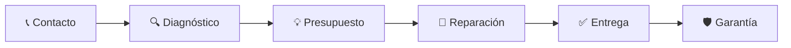

<div align="center">


<br/>


<br/>

> **Optimizamos tu vida digital con rapidez y confianza.**  
> Mantenimiento · Reparación · Venta · Soporte Técnico

<br/>

[](https://wa.me/573246339769)
[](https://github.com/WolvesTI)
[](https://wolvesti.github.io)

</div>

---

## 🐺 ¿Quiénes somos?

**WOLVES TI** es tu aliado tecnológico de confianza. Ofrecemos soluciones integrales para empresas y particulares que necesitan que su tecnología funcione **perfecta, rápida y segura**.

No somos solo técnicos — somos **tu equipo de soporte digital**.

---

## 🛠️ Nuestros Servicios

<table>
<tr>
<td width="50%">

### 💻 Mantenimiento de Equipos
- Limpieza interna (polvo, pasta térmica)
- Mantenimiento preventivo y correctivo
- Optimización del sistema operativo
- Instalación de Windows / Linux / macOS

</td>
<td width="50%">

### 🔧 Reparación Técnica
- Pantallas rotas (laptops y All-in-One)
- Teclados, cargadores, puertos dañados
- Recuperación de datos
- Diagnóstico de fallas de hardware

</td>
</tr>
<tr>
<td width="50%">

### 🛡️ Seguridad Informática
- Eliminación de virus y malware
- Configuración de antivirus y firewall
- Respaldo de información (backup)
- Asesoría en seguridad digital

</td>
<td width="50%">

### 🖥️ Venta de Tecnología
- Computadores nuevos y reacondicionados
- Periféricos y accesorios
- Memorias RAM, discos SSD/HDD
- Actualización y upgrade de equipos

</td>
</tr>
<tr>
<td width="50%">

### 🌐 Redes y Conectividad
- Instalación y configuración de redes Wi-Fi
- Cableado estructurado
- Configuración de routers y switches
- Soporte remoto y presencial

</td>
<td width="50%">

### ☁️ Servicios en la Nube
- Configuración de Google Workspace
- Microsoft 365 para empresas
- Almacenamiento en la nube
- Respaldos automáticos

</td>
</tr>
</table>

---

## ⚡ ¿Por qué elegir WOLVES TI?

```
┌─────────────────────────────────────────────────────────────────┐
│  🚀  RAPIDEZ        Diagnóstico el mismo día                    │
│  🔒  CONFIANZA      Garantía en todos los servicios             │
│  💰  PRECIO JUSTO   Sin cobros ocultos, presupuesto previo      │
│  🏠  A DOMICILIO    Vamos hasta donde estás                     │
│  📞  SOPORTE 24/7   Siempre disponibles para emergencias        │
└─────────────────────────────────────────────────────────────────┘
```

---

## 📊 Nuestro Proceso



---

## 🏆 Tecnologías que manejamos

<div align="center">


</div>

---

## 📦 Marcas con las que trabajamos

| Laptops & PCs | Componentes | Periféricos |
|:---:|:---:|:---:|
| HP · Dell · Lenovo | Kingston · Samsung | Logitech · HP |
| Asus · Acer · MSI | Western Digital · Seagate | Corsair · HyperX |
| Apple · Toshiba | Crucial · SK Hynix | TP-Link · Ubiquiti |

---

## 📍 Cobertura

```
🏙️  Bogotá D.C. y alrededores
🏢  Servicio a domicilio
💻  Soporte remoto — Colombia y Latinoamérica
```

---

## 📞 Contacto

<div align="center">

| Canal | Información |
|:---:|:---:|
| 📱 **WhatsApp** | [+57 350 541 6339](https://wa.me/573246339769) |
| 📧 **Email** | k4ledcb@gmail.com |
| 🌐 **Web** | [wolvesti.github.io](https://wolvesti.github.io) |
| 📍 **Ubicación** | Bogotá, Colombia |

<br/>

[](https://wa.me/573246339769?text=Hola!%20Vi%20tu%20perfil%20en%20GitHub%20y%20necesito%20información%20sobre%20sus%20servicios.)

</div>

---

## 🐾 Repositorios destacados

> Aquí encontrarás proyectos, scripts y herramientas de tecnología desarrollados por nuestro equipo.

---

<div align="center">

**🐺 WOLVES TI — Tu tecnología en las mejores garras**

*"Tu Computador Como Nuevo"*


</div>
